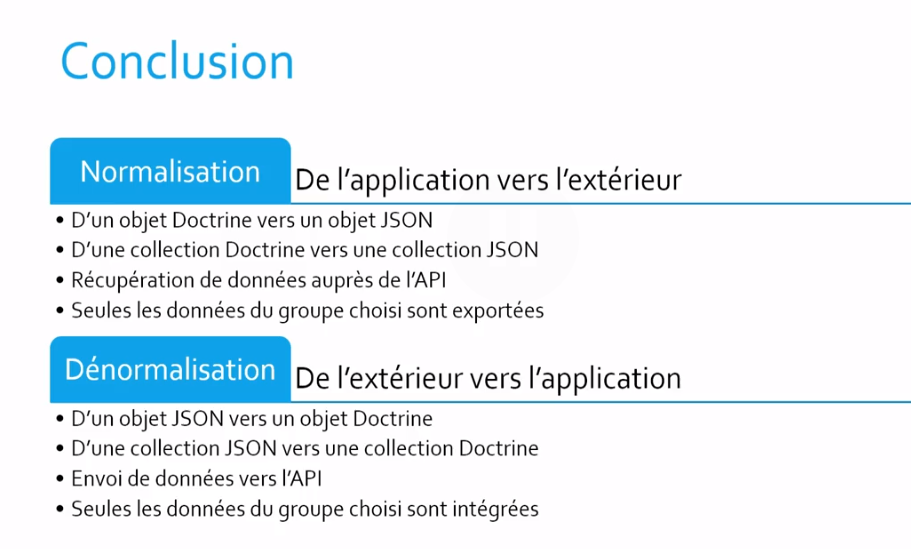

# Installing API Platform Core

```zsh
composer require api
```

Dans toutes mes entités je dois mettre.
Si une entité est liée à une autre, il faut aussi renseigner @ApiResource

```php

/**
 * @ORM\Entity(repositoryClass=UserRepository::class)
 * @ApiResource
 */
class User implements UserInterface
```

Définir perPage pour des entités

```php
/**
 * @ORM\Entity(repositoryClass=InvoiceRepository::class)
 * @ApiResource(
 * attributes={
 *      "pagination_enabled"=true,
 *      "item_per_page"=20
 *  }
 * )
 *
 */
```

## Normalisation et Sérialisation

**Normalisation**
  
 Passage d'objet PHP en Array classique.

**Sérialisation**

    Passage des tableaux php et les transformze dans un autre format ( **eg** Array Json) . Du tableau php on peut *dénormaliser* a des entités doctrines.

## #Deux contextes possibles


De doctrine vers Json et react.

de react , via un formulaire à doctrine



### Normalisation

Il faut tout d'abord créer un group sur class puis spécificier sur chaque variable le groupe en question pour qu'il soit accessible.

```php
/**
 * @ORM\Entity(repositoryClass=InvoiceRepository::class)
 * @ApiResource(
 * normalizationContext={"groups"={"invoices_read"}}
 * )
 *
 * Ordonner la propriété X en ASC ou DESC
 *  exemple: /api/invoices?order[amount]=asc
 * @ApiFilter(OrderFilter::class,properties={"amount","sentAt"})
 *
 */
```

```php
/**
 * @ORM\Column(type="string", length=255)
 * @Groups({"customers_read","invoices_read"})
 */
pri

vate $firstName;
```

## Activer / Désactiver des opérations sur une ressource

Par défaut 5 opérations sont possible

Create
Read ( all and one)
U (update)
D (delete)
Il suffit de définir les options avec

```php
/**
 * @ORM\Entity(repositoryClass=CustomerRepository::class)
 * @ApiResource(collectionOperations={"GET"={"path"="customers"},"POST"})
 */
```

## Une sous ressource : Récupérer les factures d'un client via l'url

Pour chaque ressource il est possible de créer une sous ressource.

# Sécurisation de l'API via des token JWT

```
php composer.phar require "lexik/jwt-authentication-bundle"
```

Generate the SSL keys:

```
 php bin/console lexik:jwt:generate-keypai
```

dans config/routes.yaml

```yaml
api_login_check:
   path: /api/login_check
```

dans security.yaml
```
security:
  encoders:
    App\Entity\User:
      algorithm: auto

  # https://symfony.com/doc/current/security.html#where-do-users-come-from-user-providers
  providers:
    # used to reload user from session & other features (e.g. switch_user)
    app_user_provider:
      entity:
        class: App\Entity\User
        property: email
  firewalls:
    dev:
      pattern: ^/(_(profiler|wdt)|css|images|js)/
      security: false
    login:
      pattern: ^/api/login
      stateless: true
      anonymous: true
      json_login:
        check_path: /api/login_check
        success_handler: lexik_jwt_authentication.handler.authentication_success
        failure_handler: lexik_jwt_authentication.handler.authentication_failure

    api:
      pattern: ^/api
      stateless: true
      guard:
        authenticators:
          - lexik_jwt_authentication.jwt_token_authenticator
    main:
      anonymous: true
      lazy: true
      provider: app_user_provider

      # activate different ways to authenticate
      # https://symfony.com/doc/current/security.html#firewalls-authentication
      # https://symfony.com/doc/current/security/impersonating_user.html
      # switch_user: true

  # Easy way to control access for large sections of your site
  # Note: Only the *first* access control that matches will be used
  access_control:
    # - { path: ^/admin, roles: ROLE_ADMIN }
    # - { path: ^/profile, roles: ROLE_USER }

```

Activer l'enrengistrement des utilisateurs

```
registration:
    stateless: true
    anonymous: true
```
Sécuriser la registration

```yaml
security:
  encoders:
    App\Entity\User:
      algorithm: auto

  # https://symfony.com/doc/current/security.html#where-do-users-come-from-user-providers
  providers:
    # used to reload user from session & other features (e.g. switch_user)
    app_user_provider:
      entity:
        class: App\Entity\User
        property: email
  firewalls:
    dev:
      pattern: ^/(_(profiler|wdt)|css|images|js)/
      security: false

    registration:
      pattern: ^/api/login
      stateless: true
      anonymous: true
      methods: [POST]

    login:
      pattern: ^/api/login
      stateless: true
      anonymous: true
      json_login:
        check_path: /api/login_check
        success_handler: lexik_jwt_authentication.handler.authentication_success
        failure_handler: lexik_jwt_authentication.handler.authentication_failure

    api:
      pattern: ^/api
      stateless: true
      guard:
        authenticators:
          - lexik_jwt_authentication.jwt_token_authenticator
    main:
      anonymous: true
      lazy: true
      provider: app_user_provider

      # activate different ways to authenticate
      # https://symfony.com/doc/current/security.html#firewalls-authentication
      # https://symfony.com/doc/current/security/impersonating_user.html
      # switch_user: true

  # Easy way to control access for large sections of your site
  # Note: Only the *first* access control that matches will be used
  access_control:
    # - { path: ^/admin, roles: ROLE_ADMIN }
    # - { path: ^/profile, roles: ROLE_USER }

```

Activer l'accès à l'API

