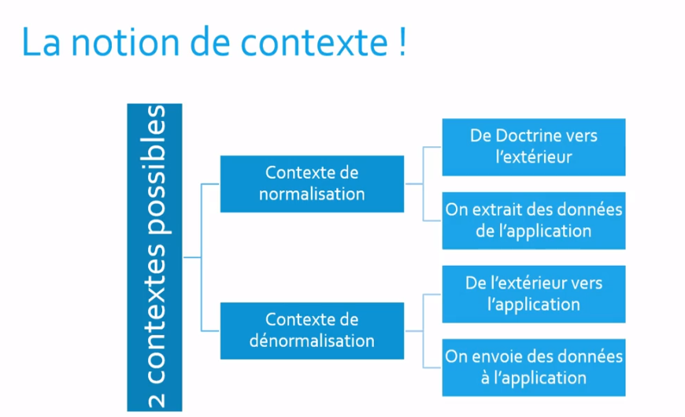
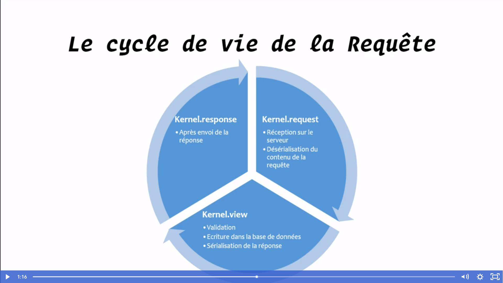

# Installing API Platform Core

```zsh
composer require api
```

Dans toutes mes entités je dois mettre.
Si une entité est liée à une autre, il faut aussi renseigner @ApiResource

```php

/**
 * @ORM\Entity(repositoryClass=UserRepository::class)
 * @ApiResource
 */
class User implements UserInterface
```

Définir perPage pour des entités

```php
/**
 * @ORM\Entity(repositoryClass=InvoiceRepository::class)
 * @ApiResource(
 * attributes={
 *      "pagination_enabled"=true,
 *      "item_per_page"=20
 *  }
 * )
 *
 */
```

## Normalisation et Sérialisation

**Normalisation**
  
 Passage d'objet PHP en Array classique.

**Sérialisation**

    Passage des tableaux php et les transformze dans un autre format ( **eg** Array Json) . Du tableau php on peut *dénormaliser* a des entités doctrines.

## #Deux contextes possibles



De doctrine vers Json et react.

de react , via un formulaire à doctrine


### Normalisation

Il faut tout d'abord créer un group sur class puis spécificier sur chaque variable le groupe en question pour qu'il soit accessible.

```php
/**
 * @ORM\Entity(repositoryClass=InvoiceRepository::class)
 * @ApiResource(
 * normalizationContext={"groups"={"invoices_read"}}
 * )
 *
 * Ordonner la propriété X en ASC ou DESC
 *  exemple: /api/invoices?order[amount]=asc
 * @ApiFilter(OrderFilter::class,properties={"amount","sentAt"})
 *
 */
```

```php
/**
 * @ORM\Column(type="string", length=255)
 * @Groups({"customers_read","invoices_read"})
 */
pri

vate $firstName;
```

## Activer / Désactiver des opérations sur une ressource

Par défaut 5 opérations sont possible

Create
Read ( all and one)
U (update)
D (delete)
Il suffit de définir les options avec

```php
/**
 * @ORM\Entity(repositoryClass=CustomerRepository::class)
 * @ApiResource(collectionOperations={"GET"={"path"="customers"},"POST"})
 */
```

## Une sous ressource : Récupérer les factures d'un client via l'url

Pour chaque ressource il est possible de créer une sous ressource.

# Sécurisation de l'API via des token JWT

```
php composer.phar require "lexik/jwt-authentication-bundle"
```

Generate the SSL keys:

```
 php bin/console lexik:jwt:generate-keypai
```

dans config/routes.yaml

```yaml
api_login_check:
   path: /api/login_check
```

dans security.yaml
```
security:
  encoders:
    App\Entity\User:
      algorithm: auto

  # https://symfony.com/doc/current/security.html#where-do-users-come-from-user-providers
  providers:
    # used to reload user from session & other features (e.g. switch_user)
    app_user_provider:
      entity:
        class: App\Entity\User
        property: email
  firewalls:
    dev:
      pattern: ^/(_(profiler|wdt)|css|images|js)/
      security: false
    login:
      pattern: ^/api/login
      stateless: true
      anonymous: true
      json_login:
        check_path: /api/login_check
        success_handler: lexik_jwt_authentication.handler.authentication_success
        failure_handler: lexik_jwt_authentication.handler.authentication_failure

    api:
      pattern: ^/api
      stateless: true
      guard:
        authenticators:
          - lexik_jwt_authentication.jwt_token_authenticator
    main:
      anonymous: true
      lazy: true
      provider: app_user_provider

      # activate different ways to authenticate
      # https://symfony.com/doc/current/security.html#firewalls-authentication
      # https://symfony.com/doc/current/security/impersonating_user.html
      # switch_user: true

  # Easy way to control access for large sections of your site
  # Note: Only the *first* access control that matches will be used
  access_control:
    # - { path: ^/admin, roles: ROLE_ADMIN }
    # - { path: ^/profile, roles: ROLE_USER }

```

Activer l'enrengistrement des utilisateurs

```
registration:
    stateless: true
    anonymous: true
```
Sécuriser la registration

```yaml
security:
  encoders:
    App\Entity\User:
      algorithm: auto

  # https://symfony.com/doc/current/security.html#where-do-users-come-from-user-providers
  providers:
    # used to reload user from session & other features (e.g. switch_user)
    app_user_provider:
      entity:
        class: App\Entity\User
        property: email
  firewalls:
    dev:
      pattern: ^/(_(profiler|wdt)|css|images|js)/
      security: false

    registration:
      pattern: ^/api/login
      stateless: true
      anonymous: true
      methods: [POST]

    login:
      pattern: ^/api/login
      stateless: true
      anonymous: true
      json_login:
        check_path: /api/login_check
        success_handler: lexik_jwt_authentication.handler.authentication_success
        failure_handler: lexik_jwt_authentication.handler.authentication_failure

    api:
      pattern: ^/api
      stateless: true
      guard:
        authenticators:
          - lexik_jwt_authentication.jwt_token_authenticator
    main:
      anonymous: true
      lazy: true
      provider: app_user_provider

      # activate different ways to authenticate
      # https://symfony.com/doc/current/security.html#firewalls-authentication
      # https://symfony.com/doc/current/security/impersonating_user.html
      # switch_user: true

  # Easy way to control access for large sections of your site
  # Note: Only the *first* access control that matches will be used
  access_control:
    # - { path: ^/admin, roles: ROLE_ADMIN }
    # - { path: ^/profile, roles: ROLE_USER }

```

Configuration finale 

```yaml
security:
  encoders:
    App\Entity\User:
      algorithm: auto

  # https://symfony.com/doc/current/security.html#where-do-users-come-from-user-providers
  providers:
    # used to reload user from session & other features (e.g. switch_user)
    app_user_provider:
      entity:
        class: App\Entity\User
        property: email
  firewalls:
    dev:
      pattern: ^/(_(profiler|wdt)|css|images|js)/
      security: false

    registration:
      pattern: ^/api/login
      stateless: true
      anonymous: true
      methods: [POST]

    login:
      pattern: ^/api/login
      stateless: true
      anonymous: true
      json_login:
        check_path: /api/login_check
        success_handler: lexik_jwt_authentication.handler.authentication_success
        failure_handler: lexik_jwt_authentication.handler.authentication_failure

    api:
      pattern: ^/api
      stateless: true
      guard:
        authenticators:
          - lexik_jwt_authentication.jwt_token_authenticator

      # Option a configurer avec access_contro !!! Aucune sécurité n'est active dans le cas contraire
      anonymous: true

    main:
      anonymous: true
      lazy: true
      provider: app_user_provider

      # activate different ways to authenticate
      # https://symfony.com/doc/current/security.html#firewalls-authentication
      # https://symfony.com/doc/current/security/impersonating_user.html
      # switch_user: true

  # Easy way to control access for large sections of your site
  # Note: Only the *first* access control that matches will be used
  access_control:
    - { path: ^/api/login, roles: IS_AUTHENTICATED_ANONYMOUSLY }
    - { path: ^/api/customers, roles: IS_AUTHENTICATED_FULLY }
    - { path: ^/api/invoices, roles: IS_AUTHENTICATED_FULLY }
    - {
        path: ^/api/users,
        roles: IS_AUTHENTICATED_FULLY,
        # POST n'est pas utile une fois connecté, on ne veut laisser la possibiliter de créer un compte si l'on est connecté
        methods: ["GET", PUT, DELETE],
      }
    - { path: ^/api/customers, roles: IS_AUTHENTICATED_FULLY }
    # - { path: ^/admin, roles: ROLE_ADMIN }
    # - { path: ^/admin, roles: ROLE_ADMIN }
    # - { path: ^/profile, roles: ROLE_USER }

```
## ApiPlatform #06 - Intervenir aux moments clés grâce aux événements du Kernel

**3 types d'évenement**



### Intervenir sur la création d'un User pour hasher le mot de passe

Créer un dossier src/Events et le fichier PasswordEncoderSubscriber.php

```php
<?php

namespace App\Events;

use App\Entity\User;
use Symfony\Component\HttpKernel\KernelEvents;
use Symfony\Component\HttpKernel\Event\ViewEvent;
use ApiPlatform\Core\EventListener\EventPriorities;
use Symfony\Component\EventDispatcher\EventSubscriberInterface;
use Symfony\Component\Security\Core\Encoder\UserPasswordEncoderInterface;

/**
 * Permet le chiffrage du mot de passe avant son enrengistrement en BDD
 */
class PasswordEncoderSubscriber implements EventSubscriberInterface
{
    /**
     * @var UserPasswordEncoderInterface
     */
    protected $encoder;

    public function __construct(UserPasswordEncoderInterface $encoder)
    {
        $this->encoder = $encoder;
    }


    /**
     * Retourne une liste des méthodes que l'on peut brancher à des événements .
     */
    public static function getSubscribedEvents()
    {
        /**
         * Liste des méthodes que l'on veut brancher à des évènements.
         * On appelle la fonction encodePassword avant l'évènement 
         * d'enrengistrement de la donnée
         * 
         */
        return [KernelEvents::VIEW => ['encodePassword', EventPriorities::PRE_WRITE]];
    }

    public function encodePassword(ViewEvent $event)
    {
        /**
         * Récupérer le résultat du controller api platform
         * Dans notre cas il s'agit d'un User
         * @var ViewEvent
         */
        $user = $event->getControllerResult();
        dd($user);

        // Renvoie la méthode utilisée GET POST, PUT ...
        $method = $event->getRequest()->getMethod();

        /**
         * Encoder le password d'un utilisateur si les conditions sont remplies.
         * Récupérer un User via la method POST ( on parle d'une création
         *  d'un utilisateur)
         */
        if ($user instanceof User && $method === "POST") {
            /**
             * Récupérer le mot de passe en claire et le définir encodée
             * @var string
             */
            $encodedPassword = $this->encodePassword($user, $user->getPassword());
            $user->setPassword($encodedPassword);
        }
    }
}

```
## Intervenir sur la création d'un Customer pour le lier à l'utilisateur courant

```php
<?php

namespace App\Events;

use App\Entity\User;
use App\Entity\Customer;
use Symfony\Component\Security\Core\Security;
use Symfony\Component\HttpKernel\KernelEvents;
use Symfony\Component\HttpKernel\Event\ViewEvent;
use ApiPlatform\Core\EventListener\EventPriorities;
use Symfony\Component\EventDispatcher\EventSubscriberInterface;
use Symfony\Component\Security\Core\Authentication\Token\Storage\TokenStorageInterface;

class CustomerUserSubscriber implements EventSubscriberInterface
{
    protected $security;

    public function __construct(Security $security)
    {
        $this->security = $security;
    }

    /**
     * Retourne une liste des méthodes que l'on peut brancher à des événements .
     */
    public static function getSubscribedEvents()
    {
        /**
         * Liste des méthodes que l'on veut brancher à des évènements.
         * On appelle la fonction setUserCustomer avant l'évènement 
         * de validation des données
         * 
         */
        return [KernelEvents::VIEW => ['setUserForCustomer', EventPriorities::PRE_VALIDATE]];
    }

    public function setUserForCustomer(ViewEvent $event)
    {
        /**
         * Récupérer le résultat du controller
         * Dans notre cas il s'agit dun 
   
         */
        $customer =  $event->getControllerResult();
        $method = $event->getRequest()->getMethod();

        if ($customer instanceof Customer && $method === "POST") {

            /**
             * Récupére l'utilisateur actuel 
             */
            $user = $this->security->getUser();

            /**
             * Rattacher notre Customer à l'utilisateur actuellement connecté
             * Condition obligatoire pour passer la validation Symfony
             */
            $customer->setUser($user);
        }
    }
}

```

## Intervenir sur la création d'une Invoice pour lui donner un chrono

```php
<?php

namespace App\Events;

use App\Entity\Invoice;
use App\Repository\InvoiceRepository;
use Symfony\Component\Security\Core\Security;
use Symfony\Component\HttpKernel\KernelEvents;
use Symfony\Component\HttpKernel\Event\ViewEvent;
use ApiPlatform\Core\EventListener\EventPriorities;
use App\Helper\CheckAndSetDate;
use Symfony\Component\EventDispatcher\EventSubscriberInterface;

class InvoiceChronoIncrement implements EventSubscriberInterface
{
    protected $security;
    protected $repository;
    protected $date;

    public function __construct(Security $security, InvoiceRepository $repository, CheckAndSetDate $date)
    {
        $this->repository = $repository;
        $this->security = $security;
        $this->date = $date;
    }
    /**
     * Retourne une liste des méthodes que l'on peut brancher à des événements .
     */
    public static function getSubscribedEvents()
    {
        /**
         * Liste des méthodes que l'on veut brancher à des évènements.
         * On appelle la fonction setUserCustomer avant l'évènement 
         * de validation des données
         * Pour passer la validation, l'incrémentation doit être définie.
         */
        return [KernelEvents::VIEW => ['setChronoForInvoice', EventPriorities::PRE_VALIDATE]];
    }

    public function setChronoForInvoice(ViewEvent $event)
    {
        /**
         * Récupérer le résultat du controller
         * Dans notre cas il s'agit d'un Invoice
         * Dans mon invoice je n'ai pas le chrono mais j'ai le customer en question !
         * @var Invoice 
         */

        $invoice =  $event->getControllerResult();
        $method = $event->getRequest()->getMethod();

        /**
         * * Si l'on récupère une instance Invoice en Post alors
         * * Récupérer l'utilisateur
         * * Récupérer le chrono de la dernière facture du customer en cours 
         *  ( il est renseigné dans l'instance invoice)
         * * Définir le chrono
         */
        if ($invoice instanceof Invoice && $method === "POST") {

            $user = $this->security->getUser();

            $nextChrono = $this->repository->findNextChrono($user);
            $invoice->setChrono($nextChrono);
            $this->date->checkAndSet($invoice);
        }
    }
}

```

## Intervenir sur la création du JWT pour enrichir ses données

Customiser ce qui est encodée dans le JWT

Décodée , le JWT nous renvoie un Json avec certaines infos

```json
{
  "iat": 1614344711,
  "exp": 1614348311,
  "roles": [
    "ROLE_USER"
  ],
  "username": "lucas.michele@guilbert.fr"
}
```

Ce n'est pas un évènement à proprement parlé comme InvoiceChronoIncrement. Il faut le configurer commme un service

```yaml
# This file is the entry point to configure your own services.
# Files in the packages/ subdirectory configure your dependencies.

# Put parameters here that don't need to change on each machine where the app is deployed
# https://symfony.com/doc/current/best_practices/configuration.html#application-related-configuration
parameters:

services:
  # default configuration for services in *this* file
  _defaults:
    autowire: true # Automatically injects dependencies in your services.
    autoconfigure: true # Automatically registers your services as commands, event subscribers, etc.

  # makes classes in src/ available to be used as services
  # this creates a service per class whose id is the fully-qualified class name
  App\:
    resource: "../src/"
    exclude:
      - "../src/DependencyInjection/"
      - "../src/Entity/"
      - "../src/Kernel.php"
      - "../src/Tests/"

  # controllers are imported separately to make sure services can be injected
  # as action arguments even if you don't extend any base controller class
  App\Controller\:
    resource: "../src/Controller/"
    tags: ["controller.service_arguments"]

  App\Events\JwtCreatedSubscriber:
    tags:
      - {
          name: kernel.event_listener,
          event: lexik_jwt_authentication.on_jwt_created,
          method: updateJwtData,
        }
  # add more service definitions when explicit configuration is needed
  # please note that last definitions always *replace* previous ones

```

```php
<?php

namespace App\Events;

use App\Entity\User;
use Lexik\Bundle\JWTAuthenticationBundle\Event\JWTCreatedEvent;

class JwtCreatedSubscriber
{
    /**
     * La fonction est appellé automatiquement lors d'un évènement de création de token 
     * pour nous permettre sa modification ou non
     */
    public function updateJwtData(JWTCreatedEvent $event)
    {
        /**
         * $event->getData()
         * 
         * Il est possible de travailler sur les datas d'un événement
         * Dans ce cas on récupère le PAYLOAD, c'est à dire les données
         * qui sont dans le token. Ces données sont modifiables.
         * 
         * On a donc un utilisateur mais on veut renseigner plus de valeur.
         * Par défaut on a un tableau avec le ROLE et userName en clée / valeur.
         * On voudrait rajouter dans le tableau firstName et lastName
         * 
         * Note : La clef est définit par le dev tandis que la valeur est obtenue 
         *        via les méthodes de la Class User ( dans notre cas ) 
         */

        /**
         * @var User
         */
        $user = $event->getUser();

        $data = $event->getData();

        $data['firstName'] = $user->getFirstName();
        $data['lastName'] = $user->getLastName();

        $event->setData($data);
    }
}

```

## Extensions de Doctrine : modifier les requêtes DQL d'ApiPlatform

A la création des entités, on a crée des events pour les modifier et intégrer
les informations manquantes ( l'utilisateur, la date ... )

Lorsqu'il s'agit d'afficher les facture. l'API renvoie toutes les factures ! Pas seulement ceux de l'utilisateur connecté ! 

Il faudra modifier la modifier la requête en cours pour prendre en compte l'utiliseur connecté.

mkdir /src/Doctrine